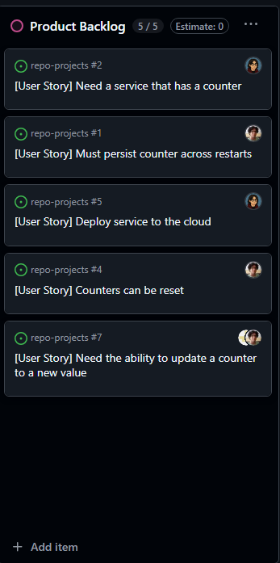
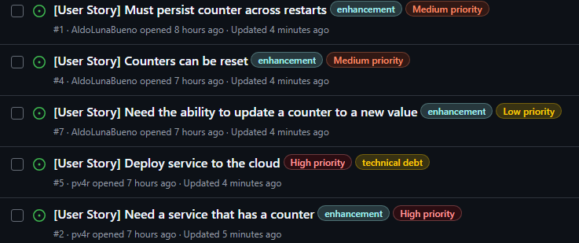
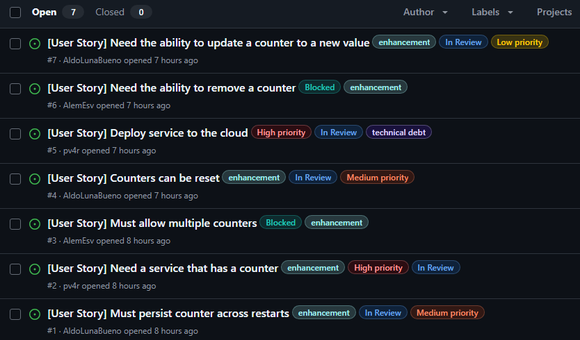
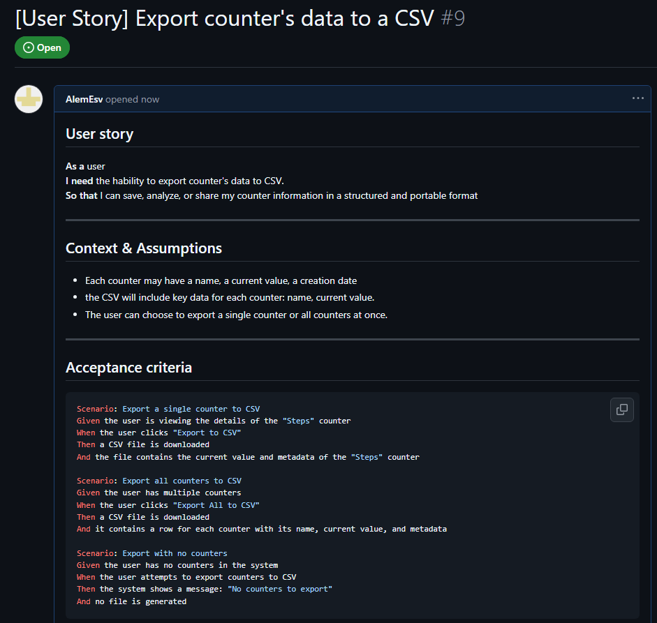

# Ejercicios (WIP)

### Ejercicio 1: Crear un Epic y vincular historias de usuario

1. Crea un nuevo Epic en tu Kanban board llamado "Gestión de Contadores".

	

2. Vincula las historias de usuario existentes, como "Need a service that has a counter", "Must allow multiple counters", y "Counters can be reset" a este Epic.

	`Need a service that has a counter`
	
	

	`Must allow multiple counters`
	
	

	`Counters can be reset`
	
	

	`Generate counter usage reports` (Nueva historia de usuario)

	

### Ejercicio 2: Uso avanzado de etiquetas (labels) para priorización y estado

a. **Creación de etiquetas(labels) de prioridad.**

En proyectos dentro de Github es necesario tener un control sobre qué problemas abordará el equipo en un periodo cercano de tiempo a comparación de otras actividades.

Algunas de estas marca son las siguientes:


Para este proyecto habrá 3 tipos de prioridad para abordar de manera eficiente cada reto propuesto en esta actividad.


b. **Asignación de etiquetas a historias de usuario**

Se mide la prioridad de los issues que estén en **Product Backlog** para tener una mayor concideración a la hora de abordarlos.



Luego se reagrupan, y se colocan las etiquetas para definir su prioridad en base a lo pedido en la actividad.



c. **Creación de etiquetas adicionales**

Para un mayor control se consideran etiquetas que verificarán si algún **intengrante** tiene problemas para resolver los **issues** y/o se quiera tener apuntado el avance de los **issues**.


Teniendo completado la información de los estados de cada **issue** para facilitar la gestión del flujo de trabajo.



### Ejercicio 3: Automatización de Kanban board con GitHub Actions

### Ejercicio 4: Seguimiento de tiempo y esfuerzo usando GitHub Projects

### Ejercicio 5: Refinamiento de backlog basado en comentarios de los stakeholders

Se ha visto comentarios de stakeholders que piden necesitan una funcionalidad para poder exportar los datos del contador a CSV, por lo que se creará un nuevo **issue** que aborde dicha funcionalidad.



Para mayor detalle en la visualización de los criterios de aceptación:

```gherkin
Scenario: Export a single counter to CSV
Given the user is viewing the details of the counter
When the user clicks "Export to CSV"
Then a CSV file is downloaded

Scenario: Export all counters to CSV
Given the user has multiple counters
When the user clicks "Export All to CSV"
Then a CSV file is downloaded

Scenario: Export with no counters
Given the user has no counters in the system
When the user attempts to export counters to CSV
Then the system shows a message: "No counters to export"
```

Luego se le colocan los labels de alta prioridad y se denota que estará listo para entrár al sprint.


### Ejercicio 6: Análisis del flujo de trabajo usando el Kanban board
