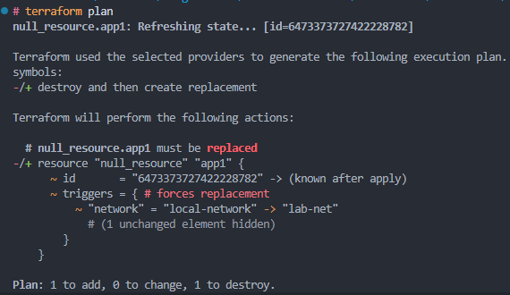
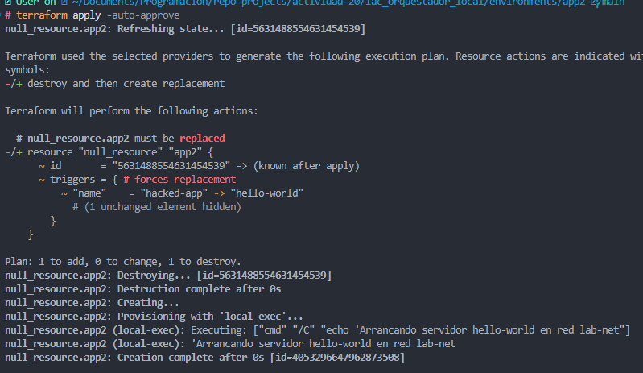
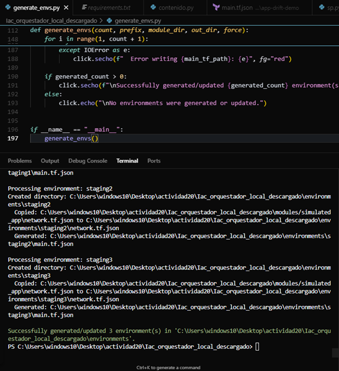
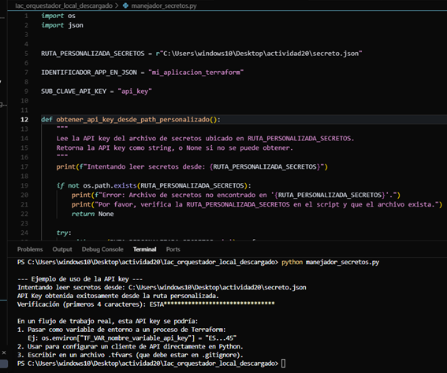

# Actividad: Escribiendo infraestructura como código en un entorno local con Terraform

## Contexto

Imagina que gestionas docenas de entornos de desarrollo locales para distintos proyectos (app1, app2, ...). En lugar de crear y parchear manualmente cada carpeta, construirás un generador en Python que produce automáticamente:

* **`network.tf.json`** (variables y descripciones)
* **`main.tf.json`** (recursos que usan esas variables)

Después verás cómo Terraform identifica cambios, remedia desvíos manuales y permite migrar configuraciones legacy a código. Todo sin depender de proveedores en la nube, Docker o APIs externas.

### Fase 0: Preparación

1. **Revisa** el [proyecto de la actividad](https://github.com/kapumota/DS/tree/main/2025-1/Iac_orquestador_local)  :

   ```json
   modules/simulated_app/
     ├─ network.tf.json
     └─ main.tf.json
   generate_envs.py
   ```

2. **Ejecutar** el proyecto:

    ```python
    # ./Iac_orquestador_local
    python generate_envs.py
    # Generados 10 entornos en 'environments/'
    cd environments/app1
    # ./Iac...local/environments/app1
    terraform init
    # Terraform has been succesfully initialized!
    terraform apply -auto-approve
    # genera los recursos de la infraestructura iniciales
    ```

3. **Objetivo**: conocer la plantilla base y el generador en Python.

### Fase 1: Expresando el cambio de infraestructura

* **Concepto**
Cuando cambian variables de configuración, Terraform los mapea a **triggers** que, a su vez, reconcilian el estado (variables ->triggers ->recursos).

* **Actividad**

    a. Modifica en `modules/simulated_app/network.tf.json` el `default` de `"network"` a `"lab-net"`.

    b. Regenera `environments/app1` con `python generate_envs.py`.

    c. `terraform plan` observa que **solo** cambia el trigger en `null_resource`.

#### Procedimiento

1. **Cambios** en `generate_envs.py`.

    Inicialmente al ejecutar el script `generate_envs.py` pasa lo siguiente:

    * Se sobreescriben los parametros `default` de las variables `name` y `network`.

    ```python
    # Parámetros de ejemplo para N entornos
    ENVS = [
        {"name": f"app{i}", "network": f"net{i}"} for i in range(1, 11)
    ]
    ```

    Para lograr visualizar el cambio al hacer `terraform plan` en la app1, modifiqué el script para que utilice los valores `default`, sino los cambios a los valores de `network.tf.json` no se reflejarán al ejecutar `terraform plan` ya que no detectará cambios en la infraestructura.

    ```python
    # Parámetros de ejemplo para N entornos
    ENVS = [
        # nombre que tendrá cada directorio para las aplicaciones
        {"name": f"app{i}"} for i in range(1, 11)
    ]
    ```

    en `generate_envs.py` se cambia `name` y `network` para que detecte valores default y no los propuestos al crear el diccionario `ENVS`

    ```diff
        "triggers": {
    -        "name":    env["name"],
    +        "name":    "${var.name}",
    -        "network": env["network"]
    +        "network": "${var.network}"
        },
    ```

    * Eliminar función de limpieza de directorios

    ```python
        # Limpia entornos viejos
        if os.path.isdir(OUT_DIR):
            import shutil
            shutil.rmtree(OUT_DIR)
    ```

    Cada que se ejecuta el script `generate_envs.py` elimina el entorno creado anteriormente, haciendo que se necesite usar el comando `terraform init` en cada app cada que se haga un cambio.

    Algo que haría que no se refleje los cambios hechos ya que la infraestructura se destruiría con cada ejecución.

2. En `modules/simulated_app/network.tf.json`, cambia:

    ```diff
        "network": [
            {
                "type": "string",
    -            "default": "local-network",
    +            "default" : "lab-net",
                "description": "Nombre de la red local"
            }
        ]
    ```

3. Regenera **solo** el app1:

   ```python
   python generate_envs.py
   # Generados 10 entornos en 'environments/'
   cd environments/app1
   # cambio de directorio
   terraform plan
   ```

    

#### Preguntas

* ¿Cómo interpreta Terraform el cambio de variable?

  * `Terraform` revisará el último estado, si las variables han sido cambiadas dará un aviso.

* ¿Qué diferencia hay entre modificar el JSON vs. parchear directamente el recurso?

  * **Modificar el JSON:** Cambias la definición antes de aplicar, es seguro y reproducible.
  * **Parchear el recurso:** Cambias el recurso ya gestionado, puede causar inconsistencias y no es reproducible.

* ¿Por qué Terraform no recrea todo el recurso, sino que aplica el cambio "in-place"?

  * `Terraform` busca el último estado de los recursos creados para no tener que regenerar toda la infraestructura cada que se llame a una modificación.

  * `Terraform` asegura el principio de idempotencia del código.

* ¿Qué pasa si editas directamente `main.tf.json` en lugar de la plantilla de variables?

  * Si el cambio es sobre `env/app1/main.tf.json` los cambios estarán solo en la `app1`, perdiendo reproductibilidad a gran escala.

  * Si el cambio es sobre `modules/.../main.tf.json`, estarías asegurando la reproductibilidad en otros entornos, pero podría no estar bien definido.

### Fase 2: Entender la inmutabilidad

#### A. Remediación de 'drift' (out-of-band changes)

1. **Simulación**

   ```diff
   cd environments/app2

   # terraform.tfstate
    "attributes": {
      "id": "5631488554631454539",
          "triggers": {
   -         "name": "hello-world", # variable generica
   +         "name": "hacked-app",
             "network": "lab-net"
          }
    }
   ```

2. Ejecuta:

   Al no haber una infraestructura real, cambio el valor dentro del archivo `terraform.tfstate` para que al usar el comando `terraform plan` este detecte el cambio e intente volver a su estado anterior.

   

3. **Aplica**

   ```bash
   terraform apply
   ```

   Este cambio se verá reflejado en los archivos, volverán al estado definido en `main.tf.json`.

    

#### B. Migrando a IaC

  1. Crea en un nuevo directorio `legacy/` un simple `run.sh` + `config.cfg` con parámetros (p.ej. puerto, ruta).

     d

  2. Escribe un script Python que:

     * Lea `config.cfg` y `run.sh`.
     * Genere **automáticamente** un par `network.tf.json` + `main.tf.json` equivalente.
     * Verifique con `terraform plan` que el resultado es igual al script legacy.


##Ejercicios:

#### Parte 1: Drift Avanzado
Creamos un entorno app-drift-demo con un maint.tf.json. Este archivo nos definió 2 servidores local_file y balanceador que dependía de los IDs de los servidores. Luego modificamos el servidor manualmente y terraform plan detectara el cambio del servidor y la necesidad de actualizar el balanceador debido a la dependencia de IDs.

  


#### Parte 2: CLI Interactiv, Refactorización de generate_envs.py con click
Modificamos el script generate_envs.py utilizando la biblioteca click. Esto nos permitió definir los argumentos de la línea de comandos como --count y --prefix. Al ejecutar este script con estos argumentos, se generó la cantidad y el tipo de entornos especificados, cada uno con sus archivos main.tf.json y network.tf.json.


  

#### Parte 3: Validación de Esquema JSON
Integramos la biblioteca jsonschema en generate_envs.py. Aquí definimos esquemas JSON (MAIN_TF_SCHEMA, NETWORK_TF_SCHEMA) para main.tf.json y network.tf.json. Antes de escribir o copiar estos archivos, su contenido se validaba contra estos esquemas para prevenir errores estructurales.

  

#### Parte 4: GitOps Local

Creamos el script watch_module_and_regenerate.py usando watchdog. Este script monitorea el directorio modules/simulated_app/ para detectar cambios. Al ocurrir una modificación, automáticamente ejecuta generate_envs.py para regenerar los entornos con parámetros predefinidos y la opción --force.

  

#### Parte 5: Compartición segura de secretos

Creamos un archivo secreto.json fuera del control de versiones con una api_key. Luego se configuro el script manejador_secretos.py para leer esta api_key desde la ruta especificada del secreto.json. Este script demostró la lectura exitosa de la clave, preparándola para un uso seguro en flujos de trabajo.

  


