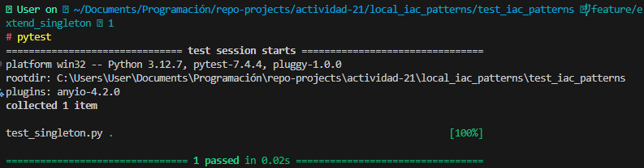
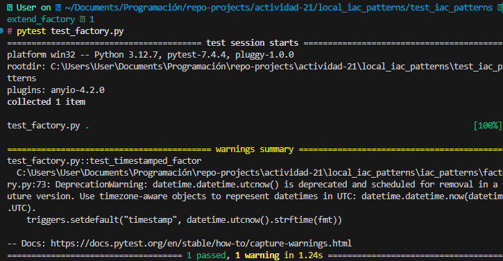

# Actividad 21

## Fase 1: Exploración y análisis

### 1. Singleton

Explica cómo `SingletonMeta` garantiza una sola instancia y el rol del `lock`.

```python
class SingletonMeta(type):
    _instances: Dict[type, "ConfigSingleton"] = {}
    _lock: threading.Lock = threading.Lock()  # Controla el acceso concurrente

    def __call__(cls, *args, **kwargs):
        with cls._lock:
            if cls not in cls._instances:
                cls._instances[cls] = super().__call__(*args, **kwargs)
        return cls._instances[cls]
```

La clase `SingletonMeta` garantiza que solo exista una instancia de la clase usando un diccionario interno `_instances: Dict[type, "ConfigSingleton"] = {}` (inicialmente vacio) donde guarda la instancia única.

*metodo `__call__`*

Cuando se intenta crear una nueva instancia, el método `__call__` revisa si ya existe una instancia ya creada; si no existe, la crea y la guarda.

*atributo `_lock`*

Controla la creación de varias instancias concurrentes de nuestra clase `SingletonMeta`, solo un hilo pueda crear la instancia a la vez.

### 2. Factory

Detalla cómo `Factory` encapsula la creación de `null_resource` y el propósito de sus `triggers`.

```python
from typing import Dict, Any
import uuid
from datetime import datetime

class NullResourceFactory:
    #deco
    @staticmethod
    def create(name: str, triggers: Dict[str, Any] | None = None) -> Dict[str, Any]:
        triggers = triggers or {}

        # Agrega un trigger por defecto: UUID aleatorio para asegurar unicidad
        triggers.setdefault("factory_uuid", str(uuid.uuid4()))

        # Agrega un trigger con timestamp actual en UTC
        triggers.setdefault("timestamp", datetime.utcnow().isoformat())

        # Retorna el recurso estructurado como se espera en archivos .tf.json
        return {
            "resource": [{
                "null_resource": [{
                    name: [{
                        "triggers": triggers
                    }]
                }]
            }]
        }

```

La clase `NullResourceFactury` encapsula la creación de recursos `null_resource` al usar un método estático `@staticmethod`. Esto permite poder llamar directamente desde la `Factory` sin crear una instancia.

útil porque la creación del recurso ya no dependerá de ningún estado interno del objeto, sino de los argumentos que recibe.

* *triggers*

Los triggers crean una uuid y un timestap para el recurso `null_resource` para que no puedan ser modificado erroneamente asegurando inmutabilidad.

### 3. Prototype

```python
import copy
from typing import Dict, Any

class ResourcePrototype:
    # constructor
    def __init__(self, resource_dict: Dict[str, Any]) -> None:
        self._resource_dict = resource_dict

    def clone(self, mutator=lambda d: d) -> "ResourcePrototype":
        new_dict = copy.deepcopy(self._resource_dict)
        mutator(new_dict)
        return ResourcePrototype(new_dict)

    @property
    def data(self) -> Dict[str, Any]:
        return self._resource_dict
```

```txt
+---------------------+
|  ResourcePrototype  |
+---------------------+
| - _resource_dict    |
+---------------------+
| + __init__()        |
| + clone(mutator)    |
| + data              |
+---------------------+
         |
         | clone(mutator)
         v
+---------------------+
|  copy.deepcopy()    |
+---------------------+
         |
         v
+---------------------+
|   mutator(new_dict) |
+---------------------+
         |
         v
+---------------------+
|  ResourcePrototype  |
|   (nuevo objeto)    |
+---------------------+
```

`Mutator` es una función que recibe el diccionario clonado, hace una copia profunda para que los cambios en los clones no afecten el objeto original. Así permite hacer personalizaciones de manera directa y que no repercutan en la forma que se instancia el diccionario original

### 4. Composite

**Tarea:** Describe cómo CompositeModule agrupa múltiples bloques en un solo JSON válido para Terraform.

Analizando la clase ``CompositeModule``, tenemos dos observaciones preliminares:

1. No trabaja directamente con cadenas JSON, sino con diccionarios de Python que las representan, lo cuál hace que la lógica del negocio esté bien encapsulada.
2. El patrón Composite se respeta, ya que las funciones que expone son compatibles: ``add`` toma como argumento un diccionario, mientras que ``export`` retorna un diccionario de las mismas características.

La clase ``CompositeModule`` define un objeto de composición que agrupa diccionarios que representan bloques de creación de recursos de Terraform. Esta agrupación es almacenada en el atributo de clase ``_children`` en forma de lista.

El método ``add`` modifica esta lista para añadir nuevos bloques en forma de diccionarios, mientras que el método ``export`` convierte esta lista en un diccionario que represente un bloque mayor unificado y lo retorna, o bien a un objeto de la misma clase ``CompositeModule`` en una jerarquía superior del árbol de composición, o bien como producto final de la composición de bloques de Terraform.

Resaltamos entonces la naturaleza recursiva del patrón, donde solo definimos lo que tiene que hacer cada nodo con los nodos inferiores para formar todo el árbol.

### 5. Builder

## Fase 2: Ejercicios prácticos

Extiende el código base en una rama nueva por ejercicio:

### Ejercicio 2.1: Extensión del Singleton

`Reset` permite limpiar la configuración sin perder información sobre la instancia o su creación

  ```python
    class ConfigSingleton(metaclass=SingletonMeta):
    # ...
    def reset(self) -> None:
        """
        Limpia las configuraciones guardadas en settings.
        """
        self.settings.clear()
  ```

Validación:

  ```python
    c1 = ConfigSingleton("dev")
    created = c1.created_at
    c1.settings["x"] = 1
    c1.reset()
    assert c1.settings == {}
    assert c1.created_at == created
  ```



### Ejercicio 2.2: Variación de la Factory

La clase `TimestampedNullResourceFactory` hereda de `NullResourceFactory` y extiende su funcionalidad para permitir que el recurso generado incluya un **timestamp**  con un formato personalizado.

```python
class TimestampedNullResourceFactory(NullResourceFactory):
    """
    Fábrica que permite especificar el formato del timestamp para el trigger.
    """

    @staticmethod
    def create(name: str, triggers: Dict[str, Any] | None = None, fmt: str = "%Y-%m-%dT%H:%M:%S") -> Dict[str, Any]:
        """
        Crea un bloque de recurso Terraform tipo `null_resource` con triggers personalizados y timestamp formateado.

        Args:
            name: Nombre del recurso dentro del bloque.
            triggers: Diccionario de valores personalizados que activan recreación del recurso.
            fmt: Formato de fecha y hora para el trigger timestamp.

        Returns:
            Diccionario compatible con la estructura JSON de Terraform para null_resource.
        """
        triggers = triggers or {}

        # Agrega un trigger por defecto: UUID aleatorio para asegurar unicidad
        triggers.setdefault("factory_uuid", str(uuid.uuid4()))

        # Agrega un trigger con timestamp actual en el formato especificado
        triggers.setdefault("timestamp", datetime.utcnow().strftime(fmt))

        # Retorna el recurso estructurado como se espera en archivos .tf.json
        return {
            "resource": [{
                "null_resource": [{
                    name: [{
                        "triggers": triggers
                    }]
                }]
            }]
        }
```

Validación:

```python
from local_iac_patterns.iac_patterns.factory import TimestampedNullResourceFactory

def test_timestamped_factor_simple():
    resource = TimestampedNullResourceFactory.create("test", fmt="%Y%m%d")
    assert "resource" in resource
    triggers = resource["resource"][0]["null_resource"][0]["test"][0]["triggers"]
    assert "timestamp" in triggers
    assert len(triggers["timestamp"]) == 8  # 'YYYYMMDD' tiene 8 caracteres
```



### Ejercicio 2.3: Mutaciones avanzadas con Prototype

### Ejercicio 2.4: Submódulos con Composite

### Ejercicio 2.5: Builder personalizado

## Fase 3: Desafíos teórico-prácticos

### 3.1 Comparativa Factory vs Prototype

### 3.2 Patrones avanzados: Adapter (código de referencia)

### 3.3 Tests automatizados con pytest

### 3.4 Escalabilidad de JSON

### 3.5 Integración con Terraform Cloud (opcional)
